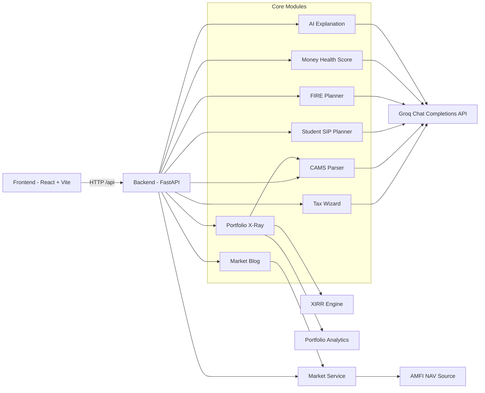
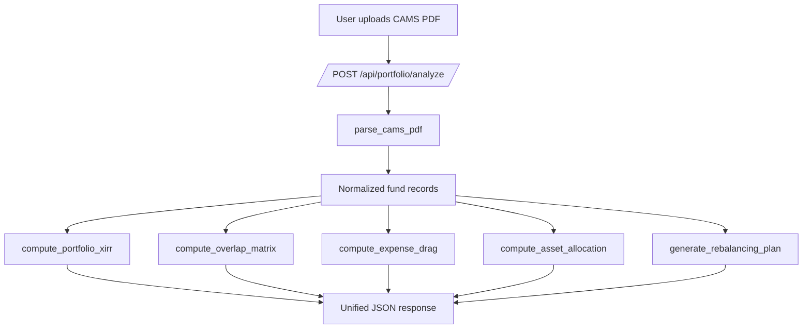

# AI Money Mentor

ET AI Hackathon 2026 - Problem Statement 9

Personalized, data-driven financial intelligence for Indian retail investors.

Current implementation includes 7 functional modules:

1. Portfolio X-Ray
2. FIRE Path Planner
3. Money Health Score
4. Tax Wizard (Individual)
5. Couple Money Planner
6. Student SIP Planner + Education Q&A
7. Market Blog (latest market details, SIP analysis, stocks watch, and article links)

This README is aligned to the current implementation in this repository.

## 1) What Is Implemented

1. Real portfolio analysis from uploaded CAMS PDF.
2. Deterministic XIRR, overlap, expense drag, and allocation analytics in Python.
3. FIRE roadmap generation using Groq for calculation and planning logic (Groq required).
4. 6-dimension Money Health Score using Groq for scoring logic and prioritized actions (Groq required).
5. Live AMFI integration for market stats and NAV search.
6. Tax Wizard with old/new regime comparison, bracket detection, deduction opportunities, and personalized recommendations (Groq required).
7. Couple Money Planner with `tax_optimized` and `equal` strategies, future-income-aware notes, and partner role recommendations (Groq required).
8. Student SIP Planner with beginner allocation plan, projected growth narrative, and Groq-powered Q&A (for example: "What is SIP?").
9. Unified planner endpoint combining Tax Wizard + Couple Planner + Student module with integrated insights.
10. Market Blog page with live AMFI-driven snapshots, curated SIP insights, stocks-watch panels, and clickable external article links.
11. Frontend dashboards for all modules (non-JSON UI cards, analysis panels, and action summaries).

## 2) Current Architecture



### Data Flow (Portfolio Path)



## 3) Module Design Summary

### Module 1 - Portfolio X-Ray

Input:
1. CAMS PDF file
2. User age (query param, default 35)

Core outputs:
1. Portfolio and fund-level XIRR
2. Overlap analysis (Jaccard)
3. Expense ratio drag and potential savings
4. Age-based allocation diagnostics
5. Rebalancing recommendations

### Module 2 - FIRE Path Planner

Input:
1. Income, expenses, corpus, liabilities
2. Risk profile
3. Goal list with timeline and cost

Core outputs:
1. FIRE corpus estimate
2. Required SIP estimates
3. Monte Carlo goal probability
4. Phased roadmap and SIP allocation (Groq-based)
5. Tax deduction summary

### Module 3 - Money Health Score

Dimensions:
1. Emergency preparedness
2. Insurance coverage
3. Diversification
4. Debt health
5. Tax efficiency
6. Retirement readiness

Core outputs:
1. Composite score (out of 100)
2. Dimension-wise scoring details
3. Priority actions (Groq-based)

### Module 4 - Tax Wizard (Individual)

Input:
1. Salary breakdown (basic, HRA, allowances)
2. Deductions (80C, 80D, 80CCD1B, etc.)
3. Risk profile
4. Additional income streams
5. Future income change (optional)

Core outputs:
1. Total income and taxable income (old/new regime)
2. Tax computation and recommended regime
3. Tax bracket classification
4. Missed deduction opportunities
5. Personalized recommendation set

### Module 5 - Couple Money Planner

Input:
1. Partner 1 profile (income, deductions, risk, future change)
2. Partner 2 profile (income, deductions, risk, future change)
3. Mode: `tax_optimized` or `equal`

Core outputs:
1. Strategy selection summary
2. Role-based income/tax allocation guidance
3. NPS/HRA/SIP split strategy
4. Future income adjustment notes

Integration behavior:
1. If partner tax analysis is missing, the planner computes it internally via Groq.

### Module 6 - Student SIP Planner + Education Q&A

Input:
1. Monthly budget
2. Investment duration
3. Risk appetite
4. Optional question/questions (for beginner Q&A)

Core outputs:
1. SIP starting amount and allocation strategy
2. Growth projection narrative
3. Learning resources by level/category
4. Q&A answers (example: "What is SIP?")

### Module 7 - Market Blog

Input:
1. Live market source statistics
2. Market search terms (ELSS, Nifty, large-cap)
3. Curated educational/article links

Core outputs:
1. Latest market details snapshot
2. SIP analysis guidance cards
3. Latest stocks market-watch style panels
4. Clickable article/news links by category (`Market`, `SIP`, `Stocks`)

## 4) AI Layer (Groq)

The AI layer uses Groq for explanation and primary calculation/logic endpoints.

Design rule:
1. Groq is required for all planner and AI-driven analytical endpoints listed below.
2. If Groq is unavailable or key is missing, these endpoints return HTTP 503.

Endpoints:
1. POST /api/ai/explain
2. POST /api/ai/analyze-full
3. POST /api/fire/plan
4. POST /api/health/score
5. POST /api/planner/tax-wizard
6. POST /api/planner/couple-money-planner
7. POST /api/planner/student-sip-planner
8. POST /api/planner/unified-financial-intelligence

Provider:
1. Groq OpenAI-compatible chat endpoint
2. Default model: llama-3.1-8b-instant (configurable via GROQ_MODEL)

Guardrail included:
1. Disclaimer forced into every AI response.

## 5) API Reference

Base URL:
1. http://localhost:8000
2. Docs: http://localhost:8000/docs

### Portfolio

1. POST /api/portfolio/analyze
2. GET /api/portfolio/demo

Analyze request:
1. multipart/form-data
2. file: PDF
3. user_age: query parameter (optional)

### FIRE

1. POST /api/fire/plan
2. GET /api/fire/demo

### Health

1. POST /api/health/score
2. GET /api/health/demo

### Market

1. GET /api/market/stats
2. GET /api/market/nav/search?q=
3. GET /api/market/nav/{scheme_code}

Used by frontend Market Blog for live market snapshot and list building.

### AI Reasoning

1. POST /api/ai/explain
2. POST /api/ai/analyze-full
3. GET /api/ai/demo-full-analysis

### Planner APIs

1. POST /api/planner/tax-wizard
2. POST /api/planner/couple-money-planner
3. POST /api/planner/student-sip-planner
4. POST /api/planner/unified-financial-intelligence

#### Tax Wizard (Individual)

Request body:

```json
{
	"salary_breakdown": {"basic": 60000, "hra": 25000, "allowances": 15000},
	"deductions": {"80C": 100000, "80D": 0, "80CCD1B": 0},
	"risk_profile": "moderate",
	"additional_income_streams": [{"source": "freelancing", "annual_amount": 120000}],
	"future_income_change": {"expected_annual_income_change": 250000, "career_shift": "moving to product role"},
	"salary_period": "monthly"
}
```

#### Couple Money Planner

Request body:

```json
{
	"partner1": {
		"name": "partner1",
		"salary_breakdown": {"basic": 80000, "hra": 30000, "allowances": 20000},
		"deductions": {"80C": 120000, "80D": 25000, "80CCD1B": 10000},
		"risk_profile": "moderate"
	},
	"partner2": {
		"name": "partner2",
		"salary_breakdown": {"basic": 45000, "hra": 15000, "allowances": 10000},
		"deductions": {"80C": 50000, "80D": 0, "80CCD1B": 0},
		"risk_profile": "low"
	},
	"mode": "tax_optimized"
}
```

#### Student SIP Planner

Request body:

```json
{
	"monthly_budget": 1000,
	"investment_duration": 4,
	"risk_appetite": "moderate",
	"user_type": "student",
	"question": "What is SIP?"
}
```

Response includes `qa_answers` and may also include per-resource `answer` fields.

#### Explain Endpoint

Request body:

```json
{
	"module": "health",
	"computed_result": {
		"total_score": 71,
		"overall_status": "On Track"
	},
	"user_context": {
		"age": 32,
		"risk_profile": "moderate"
	}
}
```

Response shape:

```json
{
	"provider": "groq",
	"model": "llama-3.1-8b-instant",
	"explanation": {
		"summary": "...",
		"key_findings": ["..."],
		"priority_actions": ["..."],
		"risk_flags": ["..."],
		"disclaimer": "This is not SEBI-registered investment advice."
	}
}
```

#### Comprehensive Analysis Endpoint

Combines FIRE, Health Score, and Portfolio data for full financial wellness analysis.

Request body (all fields optional except age and monthly_income):

```json
{
	"age": 32,
	"monthly_income": 150000,
	"monthly_expenses": 70000,
	"existing_corpus": 800000,
	"existing_loans_emi": 20000,
	"risk_profile": "moderate",
	"retirement_age": 55,
	"goals": [
		{"name": "Child Education", "type": "education", "current_cost_inr": 2500000, "years_to_goal": 15, "existing_allocation_inr": 0}
	],
	"liquid_savings": 300000,
	"term_cover": 10000000,
	"health_cover": 500000,
	"asset_classes": ["equity_mf", "debt_mf"],
	"emi_to_income_ratio": 0.20,
	"sec_80c_used": 100000,
	"required_corpus_at_60": 50000000,
	"portfolio": [
		{"scheme_name": "Mirae Asset Large Cap", "category": "Equity", "amount": 400000, "nav": 850, "units": 470, "xirr": 15.2}
	],
	"location": "Bengaluru",
	"occupation": "Software Engineer",
	"family_size": 3,
	"dependents": 1
}
```

Response shape:

```json
{
	"provider": "groq",
	"model": "llama-3.1-8b-instant",
	"analysis_type": "comprehensive",
	"result": {
		"executive_summary": "...",
		"financial_health_assessment": "...",
		"retirement_readiness_gap": "...",
		"portfolio_strengths": ["..."],
		"portfolio_risks": ["..."],
		"integrated_action_plan": ["..."],
		"risk_factors": ["..."],
		"opportunities": ["..."],
		"90_day_quick_wins": ["..."],
		"12_month_roadmap": "...",
		"rationale": ["..."]
	},
	"sebi_disclaimer": "This analysis is for informational purposes only and is not SEBI-registered investment advice."
}
```

## 6) Project Structure (Actual)

```text
ai-money-mentor/
	README.md
	start.sh
	backend/
		main.py
		requirements.txt
		routers/
			portfolio.py
			fire.py
			health.py
			market.py
			ai.py
			planner.py
		services/
			cams_parser.py
			xirr_engine.py
			portfolio_analytics.py
			fire_service.py
			health_score_service.py
			market_service.py
			tax_service.py
			couple_service.py
			student_service.py
			llm_reasoning_service.py
	frontend/
		index.html
		package.json
		src/
			App.jsx
			api/client.js
			pages/
				TaxWizard.jsx
				CouplePlanner.jsx
				StudentSipPlanner.jsx
				MarketBlog.jsx
			components/
```

## 7) Setup

### Backend

Windows:

```bash
cd backend
python -m venv venv
venv\Scripts\activate
pip install -r requirements.txt
uvicorn main:app --reload --port 8000
```

Mac/Linux:

```bash
cd backend
python -m venv venv
source venv/bin/activate
pip install -r requirements.txt
uvicorn main:app --reload --port 8000
```

### Frontend

```bash
cd frontend
npm install
npm run dev
```

Frontend URL:
1. http://localhost:5173

## 8) Environment Variables

Create backend/.env with:

```env
GROQ_API_KEY=your_groq_key
GROQ_MODEL=llama-3.1-8b-instant
```

Optional existing variables can remain. `GROQ_API_KEY` is required for all Groq-backed analytical endpoints, including planner endpoints.

## 9) Reliability and Security Notes

1. AMFI redirects are handled in market service.
2. Market endpoint returns 503 on upstream unavailability.
3. CAMS upload has file type and 10MB size checks.
4. SEBI disclaimer is included in module outputs.
5. Do not commit real API keys to git.

## 10) Implemented vs Planned

Implemented now:
1. Deterministic portfolio analytics (XIRR, overlap, allocation, drag)
2. Groq-only logic/calculation layer for FIRE and Health endpoints
3. Groq-powered Tax Wizard, Couple Planner, and Student SIP Planner
4. Unified planner intelligence endpoint
5. Student Q&A support for beginner questions (for example "What is SIP?")
6. AMFI live market integration
7. Groq explanation endpoint
8. Market Blog UI with article/news links and market/SIP/stocks sections

Planned next (target architecture):
1. PostgreSQL user profile store
2. Redis caching layer
3. ChromaDB-backed RAG in live query path
4. Additional benchmark feeds (NSE, RBI, debt indices)
5. Full holdings ingestion from factsheets

## 11) Compliance Statement

This project provides educational and informational financial insights.

It is not SEBI-registered investment advice.
